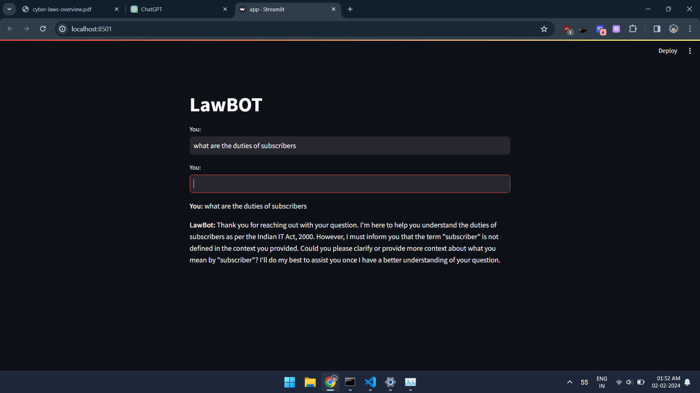

# LawBOT


LawBOT is an intelligent chatbot designed to assist users with queries related to Indian law. It utilizes the power of `Langchain` for language processing and is backed by the sophisticated `Llama-7B-chat` model provided by `Meta`. The interactive frontend user interface is built with `Streamlit` for a seamless user experience.

## Features

- **Natural Language Processing:** LawBOT leverages the advanced language processing capabilities of `Langchain` to understand and respond to user queries effectively.

- **Powerful Model:** The chatbot is powered by the `Llama-7B-chat` model by `Meta` and accessed through `Huggingface`, ensuring a high level of accuracy and relevance in responses.

- **Streamlit UI:** The frontend interface is developed using `Streamlit`, providing an intuitive and user-friendly platform for engaging with LawBOT.

## Demo



## Getting Started

To run LawBOT locally, follow these steps:

1. **Clone the Repository:**
   ```bash
   git clone https://github.com/anas-yunus/LawBOT.git

2. **Install Dependencies:**
    ```bash
    cd LawBOT
    pip install -r requirements.txt

3. **Run the Application:**
   ```bash
   streamlit run app.py
